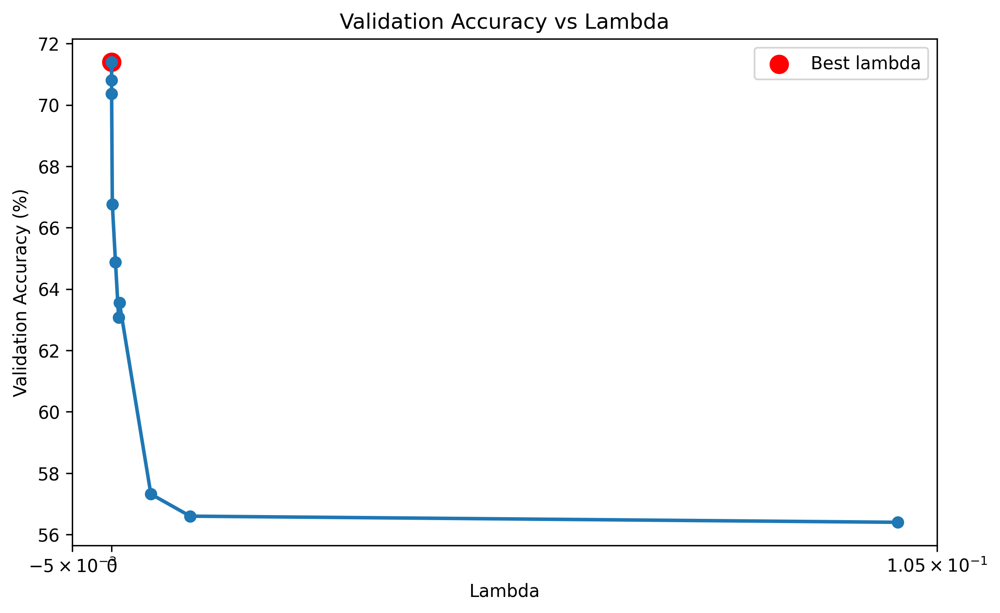
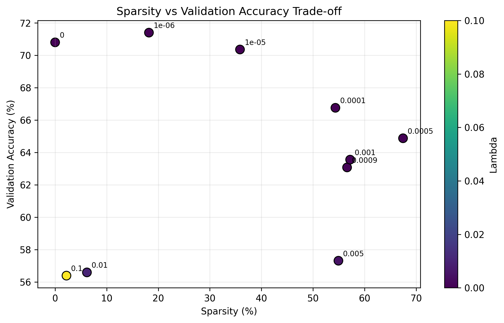
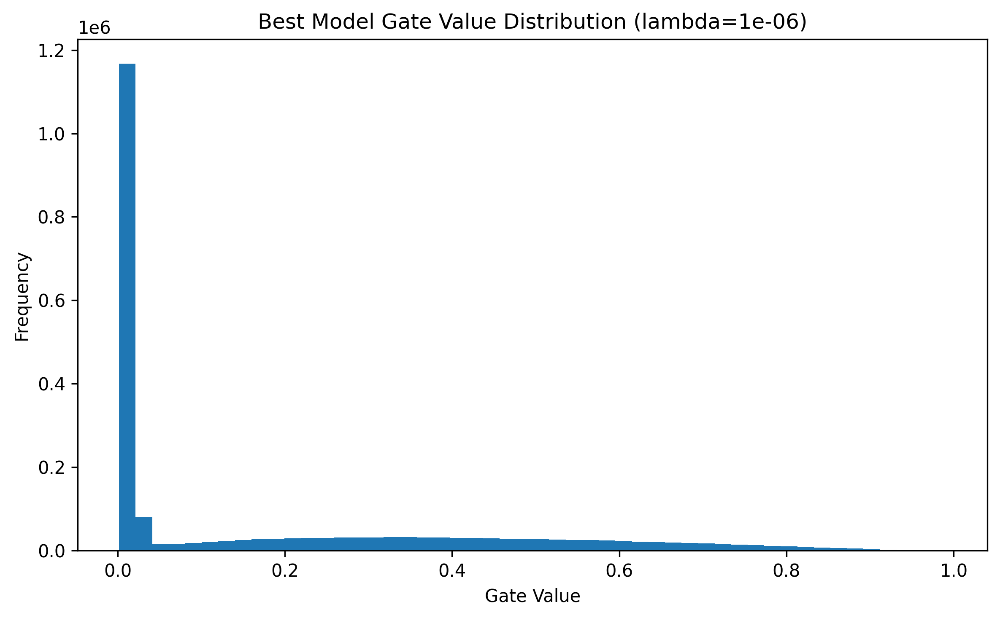

# Self-Pruning Neural Network (CIFAR-10)
Name: Sajid Miya  
Roll Number: 102367013  
Branch: Computer Science and Engineering  
Batch: 2027
---
## Problem Title

Self-Pruning Neural Network

---

## Overview

In real-world deployments, neural networks are constrained by memory, latency, and compute budgets. Traditional pruning is applied after training, requiring additional steps and often manual tuning.

This project implements a **self-pruning neural network** that learns to remove unnecessary connections **during training** using a differentiable gating mechanism. The objective is to maintain high predictive performance while encouraging sparsity in the model.

---

## Methodology

### 1) Prunable Linear Layer

A custom `PrunableLinear` layer is implemented with:

* Learnable **weights** and **bias**

* Learnable **gate_scores** (same shape as weights)

* Gates computed as:

  ```python
  gates = sigmoid(gate_scores)
  ```

* Effective weights:

  ```python
  pruned_weights = weight * gates
  ```

This formulation ensures **end-to-end differentiability**, allowing gradients to flow through both weights and gates.

---

### 2) Network Architecture

A hybrid CNN + prunable classifier architecture is used:

* Conv2d (3 -> 32, kernel=3, padding=1) + BatchNorm + ReLU + MaxPool
* Conv2d (32 -> 64, kernel=3, padding=1) + BatchNorm + ReLU + MaxPool
* Flatten: 64 x 8 x 8 -> 4096
* Dropout (p=0.5)
* PrunableLinear (4096 -> 512)
* PrunableLinear (512 -> 256)
* PrunableLinear (256 -> 10)

Only the fully connected classifier uses learnable pruning gates, so pruning pressure is applied where most dense parameters are concentrated.

---

### 3) Loss Function

Total loss:

```text
Total Loss = CrossEntropyLoss + λ * SparsityLoss
```

Where:

```text
SparsityLoss = sum(sigmoid(gate_scores))
```

**Why this works:**

* Gates are constrained to [0,1] via sigmoid
* L1-style penalty applies constant pressure toward zero
* Connections with near-zero gates are effectively pruned

---

### 4) Training Protocol

* Dataset: CIFAR-10
* Split: 95% train / 5% validation / separate test set
* Augmentation:

  * Random crop (padding=4)
  * Random horizontal flip
* Normalization: CIFAR-10 mean and std
* Optimizer: Adam
* Scheduler: StepLR (step=5, gamma=0.5)
* Reproducibility: fixed random seed
* Model selection: **best validation accuracy**
* Checkpointing: best model saved
* Fair comparison: all λ runs start from same initialization

---

## Experimental Results

### Configuration

* Train: 47,500
* Validation: 2,500
* Test: 10,000
* Sparsity threshold: 0.01

| Lambda | Validation Accuracy (%) | Test Accuracy (%) | Sparsity (%) |
| ------ | ----------: | -----------: | -----------: |
| 0      |       70.80 |        73.31 |         0.00 |
| 0.000001 |       71.40 |        74.11 |        18.19 |
| 0.00001  |       70.36 |        73.05 |        35.84 |
| 0.0001 |       66.76 |        69.56 |        54.34 |
| 0.0005 |       64.88 |        67.22 |        67.45 |
| 0.0009 |       63.08 |        66.12 |        56.60 |
| 0.001  |       63.56 |        66.18 |        57.19 |
| 0.005  |       57.32 |        60.20 |        54.92 |
| 0.01   |       56.60 |        59.68 |         6.17 |
| 0.1    |       56.40 |        59.10 |         2.20 |

### Best Configuration

* λ = 0.000001
* Validation Accuracy = 71.40%
* Test Accuracy = 74.11%
* Sparsity = 18.19%

---

## Graphs

### Lambda vs Validation Accuracy



Peak validation accuracy occurs at λ = 0.000001, indicating the best accuracy-oriented setting in this sweep.

### Sparsity vs Validation Accuracy Trade-off



This view highlights the frontier between compression and performance. Higher sparsity is achievable (up to 67.45%), but with a clear validation-accuracy drop.

### Gate Distribution (Best Model)



A concentration of gate values near zero indicates effective pruning of less important connections.

---

## Analysis & Insights

* λ = 0.000001 provides the highest validation/test performance while still inducing meaningful sparsity
* λ = 0.00001 increases sparsity substantially (35.84%) with only a small accuracy drop
* λ around 0.0001 to 0.001 pushes sparsity above 50%, but accuracy declines significantly
* Very high λ values (0.01, 0.1) degrade accuracy and also reduce sparsity, indicating **optimization instability**

**Important observation:**

At higher λ values, sparsity unexpectedly decreases. This is likely due to:

* **Sigmoid saturation**, causing vanishing gradients for gate updates
* Competition between classification loss and sparsity loss
* Optimization settling in suboptimal regions with partially active gates

This highlights a limitation of sigmoid-based gating and suggests:

* Temperature-scaled sigmoid
* L0 regularization (Hard Concrete)

---

## Limitations

* **Soft pruning only**: weights are suppressed but not physically removed
* No reduction in FLOPs or inference latency unless hard-pruning/export is added
* Sigmoid gates can saturate, which may slow gate optimization at extreme lambda values

---


## How to Run

Activate the virtual environment (PowerShell):

```powershell
.\.venv\Scripts\Activate.ps1
```

Install dependencies:

```bash
pip install -r requirements.txt
```

Run training (same style as your session):

```powershell
py self_pruning_cifar10.py
```

---

## Outputs

* `graphs/validation_accuracy_vs_lambda.png`
* `graphs/sparsity_vs_validation_accuracy_tradeoff.png`
* `graphs/best_model_gates.png`
* `best_model_checkpoint.pth`

---

## Conclusion

This project demonstrates that **self-pruning during training is feasible and effective** using differentiable gating. The latest sweep shows a strong operating point at λ = 0.000001 (best accuracy with non-trivial sparsity) and a controllable sparsity-accuracy trade-off across larger λ values.
