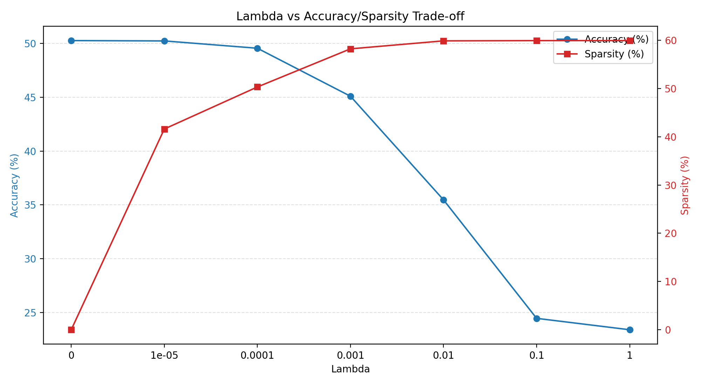
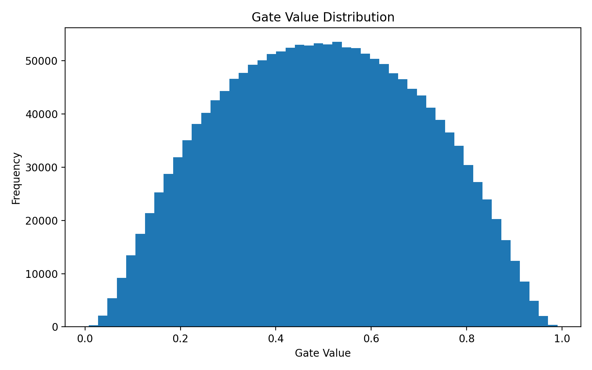

# Self-Pruning Neural Network Case Study

## Overview

This submission implements a feed-forward CIFAR-10 classifier that prunes itself during
training through learnable gate parameters. Every weight in each custom
`PrunableLinear` layer has a matching `gate_score`. The score is transformed with a
sigmoid, producing a gate in `[0, 1]`, and the effective weight becomes:

`effective_weight = weight * sigmoid(gate_score)`

During training, the objective combines standard cross-entropy classification loss with
an L1 penalty on the gate values:

`Total Loss = Classification Loss + lambda * Sparsity Loss`

where:

`Sparsity Loss = sum(sigmoid(gate_score))` across all prunable layers.

## Why L1 On Sigmoid Gates Encourages Sparsity

The L1 penalty adds a direct cost for every gate that remains open. Since each gate is
constrained to the range `[0, 1]` by the sigmoid, minimizing the sum of gate values
encourages the optimizer to push unnecessary gates toward zero. A gate near zero
suppresses its corresponding weight, effectively removing that connection from the
network. The classification loss prevents all gates from collapsing, so the model is
forced to keep only the connections that help accuracy most.

In practice, sigmoid gates rarely become mathematically exact zeros, so sparsity is
measured using a small threshold (`1e-2` in this implementation). Any gate below this
threshold is counted as pruned.

## Results

The table below comes from a completed local run with:

- 10 epochs
- train samples 50000 and test samples 10000
- pruning threshold `1e-2`

| **Lambda** | **Accuracy** | **Sparsity (%)** |
|------------|--------------|------------------|
| 0          | 50.01%       | 0.00%            |
| 1e-05      | 50.24%       | 41.61%           |
| 0.0001     | 49.56%       | 50.32%           |
| 0.001      | 45.10%       | 58.22%           |
| 0.01       | 35.47%       | 59.88%           |
| 0.1        | 24.46%       | 59.93%           |
| 1          | 23.40%       | 59.93%           |

The best accuracy came from `lambda = 1e-5`, while larger lambda values produced
lower accuracy and higher sparsity. This is the expected trade-off for gate
regularization.

## Best Model Gate Distribution

After the experiments finish:





## How To Run

Install dependencies:

```bash
pip install -r requirements.txt
```

Run:

```bash
python self_pruning_cifar10.py 

```
